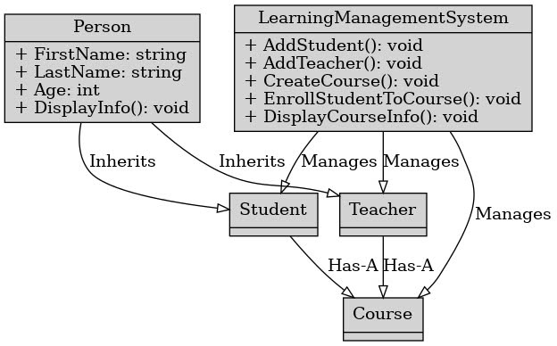

# LEARNING C# .NET ASP CORE IN T3H

# 1. Git, Github , Visual studio

# 2. Function in C#

# 3. Condition (IF - ELSE)

# 4. Swith Case & Use Enum 

# 5. LOOP
>> for (star; end ; step){ code..}
- cách hoạt động: lặp từ start tới xát end, theo từng step
- dùng khi biết trước được số lần cần lặp, và khi nào cần dừng
- 
>> cú pháp
  for(<bieu_thuc_1>; <bieu_thuc_2>; <bieu_thuc_3>){
      --code--
  }

  - <bieu_thuc_1>: biến khởi tạo giá trị ban đầu
  - <bieu_thuc_2>: điều kiện để tiếp tục lặp
  - <bieu_thuc_3>: tăng giá trị của biến khởi tạo giá trị ban đầu

  VD: for(var i = 1; i < 5; i++){
      --code--
  }

>> while(điều kiện lặp){ code lặp}
 >> cú pháp
  while(<dieu_kien>){
      --code--
  }

  >> cách hoạt động
  - nếu điều kiện đúng thì sẽ thực hiện các dòng code trong dấu {}

>> do while

>> cú pháp
  do{
      --code--
  }while(<dieu_kien>)

  >> cách hoạt động
  - lần đầu tiên sẽ thực hiện các dòng code trong dấu {} mà không cần xét điều kiện
    từ lần thứ hai trở đi nếu điều kiện đúng sẽ thực hiện các dòng code trong dấu {}
- giông while nhưng cho vào rồi mới kiểm tra điều kiện, while thì kt rồi mới cho vào

>>Câu lệnh Break và Continue 
  >> break
  - nếu break ở trong vòng lặp thì vòng lặp gần nhất đang chứa nó sẽ bị dừng không tiếp tục lặp nữa
  - thoả mãn dk --> dừng vòng lặp luôn

  >> continue
  - tất cả các dòng code bên dưới continue sẽ được bỏ qua
  - nếu continue ở trong vòng lặp thì sẽ bỏ qua các dòng code bên dưới và tiếp tục vòng lặp mới
  - thoả mãn điều kiện --> bước qua 

# 6. ARRAY & LIST
>> ARRAY: 
- mảng chứa tập hợp các giá trị có cùng kiểu dữ liệu
>> cú pháp:
- cách 1: datatype[] nameArray = { value1, value2,...} --> chứa giá trị khởi tạo ban đầu
- cách2 : datatype[] nameArray = new datatype[length] 
	- mảng rỗng, biết độ dài
    - datatype: kiểu dữ liệu
    - nameArray: tên mảng
    - value..: các element của mảng
    - length: độ dài mảng
>> VD:  int[] numbers = new int[length]
--> khác với js, c# Có kích thước cố định sau khi tạo,
>> LIST:
- danh sách: giống array nhưng có thể thay đổi độ dài
-  List<T> Kích thước có thể thay đổi, 
- nhưng kiểu dữ liệu của phần tử không thể thay đổi.
>> syntax
- List<int> numbers = new List<int>(); // Khởi tạo danh sách rỗng
 // Khởi tạo danh sách với các phần tử
- List<string> fruits = new List<string> { "Apple", "Banana" }; 
- cách hoạt động các hàm có phần giống string và array
# 6.1. LINQ
>> lấy dữ liệu trong database lưu tạm trong list 
>> từ list tiến hành truy vấn linq --> dễ dàng hơn
>> linq: sự kết hợp của extension method với delegate
>> delegate: đối số của 1 function là 1 function khác
- example
- // Phương thức tương thích với delegate
public int Add(int x, int y)
{
    return x + y;
}

// Khởi tạo delegate
MathDelegate mathDel = new MathDelegate(Add);

// Gọi delegate với tham số
int result = mathDel(5, 3);
Console.WriteLine("Result: " + result);
# Delegate Function
>> tham số của một hàm là một function 
- function giúp sử lý một việc gì đó --> return : true/false --> xử lý hàm 
- vd: kiểm tra xem điểm nhập đúng không

       public double ValidateScoreWithCondition(string subject, Func<double, bool> condition)
        {
            Console.WriteLine($"Input the {subject} score");
            var check = double.TryParse(Console.ReadLine(), out var score) && condition(score);
            while (!check)
            {
                Console.WriteLine($"The {subject} score is not correct,reinput");
                check = double.TryParse(Console.ReadLine(), out score) && condition(score);
            }
            return score;
        }

>> Func là delegate: Đại diện cho các phương thức có giá trị trả về.
- Có thể nhận từ 0 đến 16 tham số: Tùy thuộc vào số lượng tham số mà bạn muốn truyền vào delegate.
- Có thể sử dụng trong nhiều tình huống: Ví dụ như truyền phương thức như tham số cho các phương thức khác, lưu trữ các phương thức để gọi sau, hoặc trong các biểu thức lambda.
- Func rất hữu ích trong lập trình C# khi bạn cần thực hiện các phép toán, xử lý dữ liệu, hoặc thực hiện các thao tác khác với các phương thức không cần phải trả về giá trị.
- như kiểu lai với js trong lamda, function
>> Example

    static void Main()
    {
        // Sử dụng Func trong một phương thức
        int result = PerformOperation(3, 4, (x, y) => x + y);
        Console.WriteLine(result); // Output: 7
    }

    static int PerformOperation(int a, int b, Func<int, int, int> operation)
    {
        return operation(a, b);
    }

- giải thích
    - Func<int, int, int> operation : khai báo function với các tham số
    - triển khai hàm dưới arrow function javascript
>> Extension Methods là một công cụ hữu ích trong C# để:
s
- Thêm tính năng mới cho các lớp hiện có mà không cần thay đổi mã nguồn.
- Cải thiện tính đọc hiểu của mã.
- Tạo API dễ sử dụng hơn.
- Bổ sung tính năng cho các lớp tự định nghĩa.
>> Syntax
- Phương thức mở rộng phải là static và tham số đầu tiên của nó phải 
  - là đối tượng mà bạn muốn mở rộng, 
  - với từ khóa this trước tham số đó.
>> Example

    // nomal method
      public void Print(string message)
            {
                Console.WriteLine($"C1- the value is {message}");
            }   
        }

    // extension function (hàm mở rộng)
    public static class LearnExtension1
    {
        public static void Print(this string message)
        {
            Console.WriteLine($"C2 -the value is {message}");
        }
    }
>>gọi hàm

    var value = "ronaldo";
>> gọi hàm thông thường

    var learnExtension = new LearnExtension(); 
    learnExtension.Print(value);*/
>> gọi hàm extension

    // static nên gọi trực tiếp không cần khởi tạo đối tượng
    value.Print(); //--> C2 -the value is ronaldo
>> Kết hợp delegate và extension method ta được linq
- example

# Action: 
- hành động nào đấy không cần kết quả trả về, tương đồng với void function nhưng khác ờ chỗ
- Hàm void: Được sử dụng trong nhiều loại ứng dụng và ngữ cảnh lập trình để thực hiện các
tác vụ mà không cần trả lại giá trị.
    - Chúng có thể là các hàm trợ giúp, xử lý sự kiện, hoặc các chức năng khác.
- Action: Được sử dụng trong các framework web như ASP.NET MVC hoặc ASP.NET Core 
- để xử lý yêu cầu HTTP và trả về kết quả cho client. Trong ASP.NET Core MVC, action thường trả về IActionResult hoặc ActionResult, không phải void.

- cú pháp giống function trong js
>> 

    Action<string, int> printMessage = (message, count) =>
    {
		for (int i = 0; i < count; i++)
		{
			Console.WriteLine(message);
		}
    };
    printMessage("Hello", 3); -->   Hello 3

- systax: Action<tham số 1, tham số 2...> tên hàm = (tham số 1, tham số 2, ...)=> { khồi lệnh};
- có thể handel thêm chức năng nào đấy của object với vai trò Action là tham số

>> Example:  
  
      public void HandleStudentScore(Action<double> handleScore) //tham số là 1 action c#
        {
            Console.WriteLine("input the student score");
            double score = double.Parse(Console.ReadLine());
            handleScore(score);

        }

- được khởi tạo nhưng sẽ không chay và chỉ chạy khi được chuyền vào đối số của 1 object nào đó  --> và được chiệu gọi 
    

# LinQ

# Một số các Extension Method của string
>> string

>> string builder,các method điều có trên string nhưng hiệu năng ok hơn string

# OOP
- kế thừa: con sẽ kế thừa các thuộc tình, phương thức public của cha

- Method Virtual: ảo ở lớp, sau đó viết overide (ghi đè) ở lớp con --> Tính đa hình
- Phân biêt abstract và virtual (cha) --> override ở con
- virtual (ảo): cha phải có thân hàm, con có thể có override hoặc không
- abstract (trừu tượng): cha không có thân hàm, con bắt buộc phải có override
    - abstract class: không gọi trực tiếp bên main được
- 1 vài trường hợp update, qua viewmodel: tạo 1 cái model khác để update , 
tránh trường hợp update vào thẳng vào cái chính

    >> CTRL + . >> ra cái bóng đèn (gợi ý code)

- interface: 1 class có chứa các (chữ ký) method, ko có thân hàm
    --> các class con kế thừa sẽ override lại phương thức đó
- IGeneric: 1 kiểu interface rộng hơn, dùng chung cho nhiều các object, class
- BaseEntity: tạo ra 1 class cha dùng chung với các properties được khai báo sẵn
    - các object con kế thừa và sử dụng các properties của BaseEntity
>> Example

     public abstract class BaseEntity<TKey>  // properties dùng chung ở object cha
        {
            public TKey Id { get; set; }
        }

     public class Blog:  BaseEntity<int>    // object con kế thừa và sử dụng
	    {
	        //	public int Id { get; set; }
	    }
- systax: 
# EX1: Manager Education

# Clean Code
- folder Abstract chứa các Generic InterFace
- folder Helpers : các hàm hỗ trợ như Validate....

# Lập trình bất đồng bộ
## KHÁI NIỆM
- a) Đồng bộ:
Ứng dụng console tính toán hoặc xử lý dữ liệu đơn giản.
Xử lý các tác vụ nhỏ không gây ra chờ đợi
	 (ví dụ: tính toán toán học, truy xuất dữ liệu bộ nhớ).
b) Bất đồng bộ:
Ứng dụng web xử lý nhiều yêu cầu từ người dùng và thực hiện các tác
	vụ như truy vấn cơ sở dữ liệu.
Ứng dụng giao diện người dùng (UI) khi bạn cần đảm bảo người 
	 dùng vẫn có thể tương tác với giao diện trong khi chờ dữ liệu từ API hoặc đọc/ghi file.
- lập trình bất đồng bộ có thể được hình dung giống như chạy tiếp sức.
Mỗi tác vụ bất đồng bộ giống như một vận động viên trong đội chạy
tiếp sức. Mỗi người chỉ chạy khi đã nhận được que tiếp sức từ người
chạy trước, và đến lượt mình, họ sẽ đưa que tiếp sức cho người tiếp theo.

Trong lập trình bất đồng bộ:

Khi một tác vụ (Task) đang chờ một việc gì đó hoàn thành (ví dụ: đọc dữ liệu từ cơ sở dữ liệu, chờ phản hồi từ API), nó không chiếm giữ tài nguyên mà có thể "tạm nghỉ" và chờ kết quả.
Khi kết quả đã sẵn sàng, nó tiếp tục chạy và trả kết quả cho tác vụ tiếp theo, giống như người chạy nhận que tiếp sức và chạy tiếp.
Cách này giúp hệ thống không bị lãng phí tài nguyên khi chờ đợi và có thể làm những việc khác trong lúc chờ đợi, làm tăng hiệu suất chung. Đây là điểm mạnh của lập trình bất đồng bộ so với lập trình đồng bộ truyền thống, nơi mà một nhiệm vụ phải đợi xong trước khi tiếp tục nhiệm vụ tiếp theo.

Cơ chế này giúp ứng dụng có thể phục vụ nhiều yêu cầu hơn mà không bị "nghẽn" bởi những tác vụ dài hạn, như truy cập cơ sở dữ liệu hoặc gọi API từ bên ngoài.

Anh có thể tưởng tượng thêm, mỗi tác vụ không cần phải đứng đợi ở đó mà có thể đi làm việc khác, khi que tiếp sức (kết quả) tới thì lập tức quay lại chạy tiếp.
- async: Được đặt trước một phương thức để chỉ ra rằng phương thức 
	- này thực hiện bất đồng bộ.
- Task<string>: Cho biết rằng phương thức trả về một tác vụ 
	- (task) có kết quả là một chuỗi (string).
- await: Sử dụng để chờ một tác vụ hoàn thành mà không chặn luồng
	- chính. Khi gặp await, luồng chính có thể thực hiện những tác vụ khác cho đến khi tác vụ chờ hoàn thành.

## Mối quan hệ giữa Repository và Unit of Work
Repository chịu trách nhiệm cung cấp các thao tác CRUD cơ bản cho 
- một thực thể (Entity) cụ thể (ví dụ như Product, Category,...).
Unit of Work kết hợp các repository khác nhau và đảm bảo rằng tất 
- cả các thay đổi trong phiên làm việc sẽ được thực hiện trong một 
- giao dịch (transaction). Nếu có lỗi xảy ra, Unit of Work sẽ rollback 
- tất cả các thay đổi để bảo toàn tính nhất quán của dữ liệu.